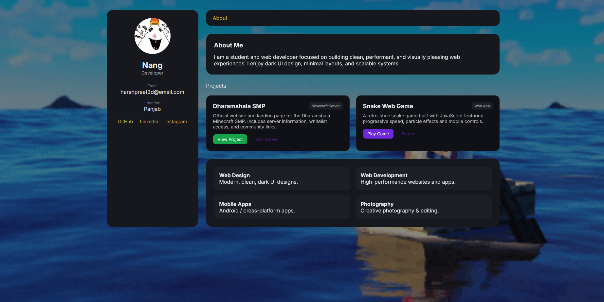
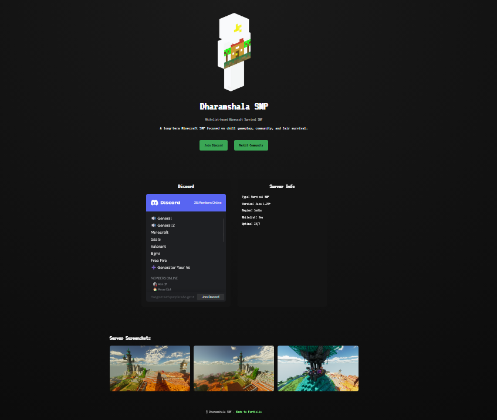

# harshpreet.live

This repository contains the source code for my personal website: **harshpreet.live**.

The site is built using plain **HTML, CSS, and JavaScript**.  
I’m intentionally keeping it lightweight and framework-free while I learn the fundamentals of web development.

## Purpose

The main goal of this website is to act as:
- A personal portfolio
- A central place to link my projects and socials
- A showcase of my progress in web development over time

I plan to continuously update and improve this site as I learn new technologies and build more projects.

## Screenshots

### Website

### Dharamshala SMP

## Current Features

- Personal landing page
- Information about my Minecraft server (Dharamshala SMP)
- Links to my socials (Instagram, Steam, YouTube)
- Clean, minimal, glass-style UI with smooth animations

## Tech Stack

- HTML
- CSS
- JavaScript

No frameworks or libraries are used.

## Roadmap

- Expand portfolio section
- Improve accessibility and mobile responsiveness
- Add more projects and content
- Optimize performance and SEO

## Status

This project is a **work in progress** and will evolve as my skills grow.
